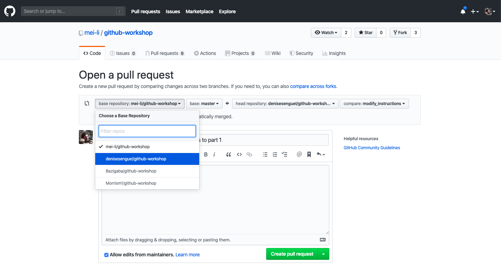
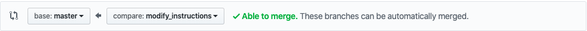

# github-workshop

Github flow workshops 

[Slides from Meili](https://docs.google.com/presentation/d/14BZu5jpCzmWOHfjViLCeycy6ugyDZV9bGC074TMu9Jo/edit?usp=sharing)
[Slides from Denise](https://docs.google.com/presentation/d/18bI6VhPjsbpbTy51Ba7jh3lmS09zsnfMF778IiKDwYM/edit?usp=sharing)

## Install git

If you don't have git on your machine, [install it]( https://help.github.com/articles/set-up-git/).

## Become a collaborator in this repository
Come over to me to add you as a collaborator of this repository.

## Part I  - Github flow
### Clone the repository


Now clone the repository to your machine. Go to your GitHub account, open the repository, click on the clone button and then click the *copy to clipboard* icon.

Open a terminal and run the following git command:

```
git clone <url you just copied>
```
where "url you just copied" (without the < > signs) is the url to this repository. See the previous steps to obtain the url.


### Create a branch

Change to the repository directory on your computer (if you are not already there):

```
cd github-workshop
```
Now create a branch using the `git checkout` command:
```
git checkout -b <add-your-new-branch-name>
```
On your branch (local copy of the repository) you will edit the file `commit-messages.md` in this repository and add some tips on how to write good commit messages. Give your branch a meaningful name, including your name so that it is not the same as the branch of everyone else in the workshop.

For example:
```
git checkout -b add-george-tips
```

### Make necessary changes and commit those changes

Now open `commit-messages.md` file in a text editor, and add your tips for writing good commit messages. 
Save the changed markdown file.


If you go to the project directory and execute the command `git status`, you'll see there are changes.


Add those changes to the branch you just created using the `git add` command:

```
git add commit-messages.md
```

Hit `git status` again to see how the changes are still there but now they are staged for commit (it's a necessary preparation)

Now commit those changes with a nice commit message using the `git commit` command:
```
git commit -m "Add HERE your commit message"
```
replacing the text in `""` with your commit message.

Up until now, you have not submitted anything to GitHub!


### Push changes to GitHub

Push your changes using the command `git push`:
```
git push origin <add-your-branch-name>
```
replacing `<add-your-branch-name>` with the name of the branch you created earlier.



### Submit your changes for review

Now go to your repository on GitHub, you'll see a  `Compare & pull request` button. Click on that button.

Before sumitting the Pull Request, make sure to change the base repository from Meili's repository to the current fork on profile denisesenguel.
Afterwards it should be `master` at the left and your branch at the right. Sth like



You may change the title of the Pull request if you want to. It should be short but informative about all the changes you did.
Now submit the pull request.

### Get a review

Now exchange reviewes with a person sitting near you. In GitHub you can assign them as a reviewer in your Pull Request or tell/send them your Pull request number.

### Submit a review
Github offers 2 ways of reviewing, either with `single comments` or with `start review` that let you add multiple comments that will be visible when selecting the `submit review`. This way they will show all together. Use the `single comments`

Add a review and ask the author to make some change. A review should be respectful and explain the reason that the change is needed, giving context. 

### Address comments

Address the comments of the review or reply to them explaining your reasoning. If see that the suggested changes make sense, make the changes locally and save. Then add, commit and push the updates to GitHub as you did with the initial changes.

Use a meaningful commit message when addressing the comments eg. `Improve wording` instead of `addressing comments`

### Where to go from here?

Congrats!  You just completed the standard clone -> edit -> PR_ workflow that helps you collaborate and share knowledge with your team!


## Part II - Undoing changes

If you realize that you want to undo some changes you've made, you have several options and it depends on what you have done before.
Rewritting history in git is possible. One should be careful not to do that, in general because changes might get lost and in particular on any branch that is already shared with somebody else. 
To be on the safe side do history rewrites **before** pushing the commits or even better in an additional branch!

### Your options

- If you have not added (we call it "staged") or commited a change yet `git checkout <filename>` removes all of the local changes on the file.  Be careful with this one, you might easily lose relevant work
- If you have already added but not yet commited a change `git reset HEAD <filename>`
- `git commit --amend -m "your new commit message"` lets you add some changes to your previous commit 
- `git revert <commitID>` lets you undo a specific commit as an additional commit. This is a very safe option but may not always the right one.
- `git reset <commitID>` reset your repository back to the status of a specific commit. all changes afterwards will be lost


### Rewriting history

Get the ugly-history branch and start a new branch from it

```
git checkout <ugly-history>
git checkout -b <your_new_branch>
``` 

## Look at the commits

Use git log to look at the commit messages

```
git log -5
```

## Rewrite the last 4 commits

Undo the last 4 commits and split them into two, one adding the `hello.py` file and one the `goodbye.py`


## Undo a commit


## Before pushing

Imagine that you forgot to add some comment. Add a random comment in the code and amend the last commit.

## Push and make a Pull request

Push your new branch and make a Pull request. Ask for your reviewer to check the commits. 

## Optional: play around with .gitignore

As the name suggests `.gitignore` is a list of files to be ignored by git. That means that changes in these files will not be tracked and thus also not end up on GitHub or any other hosting service. (example: sensitive data)

Create a new empty file of any type to your repository.
Open the hidden file `.gitignore` via your Terminal in a text editor.
Add the new file you just created **and** another previously existing file in your repository to the file list.
Add and commit your changes and watch what happens to understand `.gitignore` better.


### Some Tips

If a command like add, commit or reset applies to all of your changed files (not just one) use for example `git add .` or `git add *` to not run the command on every single file separately.

## Prettify

To make your git log look more compact like this:
```
16fed12 [4 minutes ago] (Meili Triantafyllidi) improve commit message tip
5a964a3 [13 minutes ago] (Meili Triantafyllidi) add slides and start part II
13ddeff [14 minutes ago] (Meili Triantafyllidi) add assets
707334e [4 hours ago] (Meili Triantafyllidi) add github workflow part I
```

you can edit your `.gitconfig` file which is in you home directory and add this in the format section. Like this:

```
[format]
  pretty = %C(magenta reverse)%h%Creset %Cgreen[%cr]%Creset (%an) %s

```


### Additional material

Ways to undo changes in your commit history
[Git Reset, Revert and Checkout](https://www.atlassian.com/git/tutorials/resetting-checking-out-and-reverting)

Gitlab workshop:
[Gitlab workflow](https://about.gitlab.com/blog/2017/03/17/demo-mastering-code-review-with-gitlab/)


